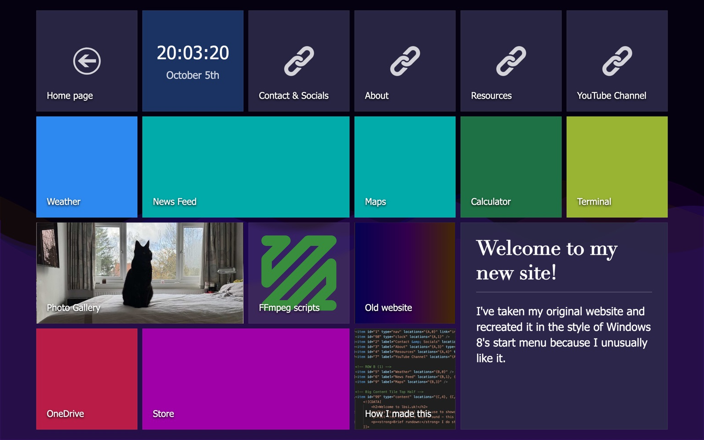
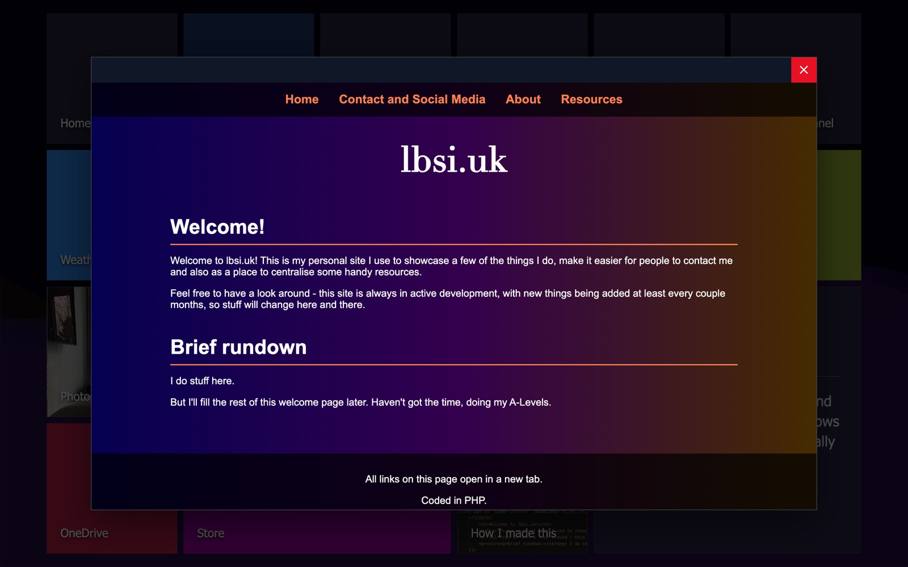
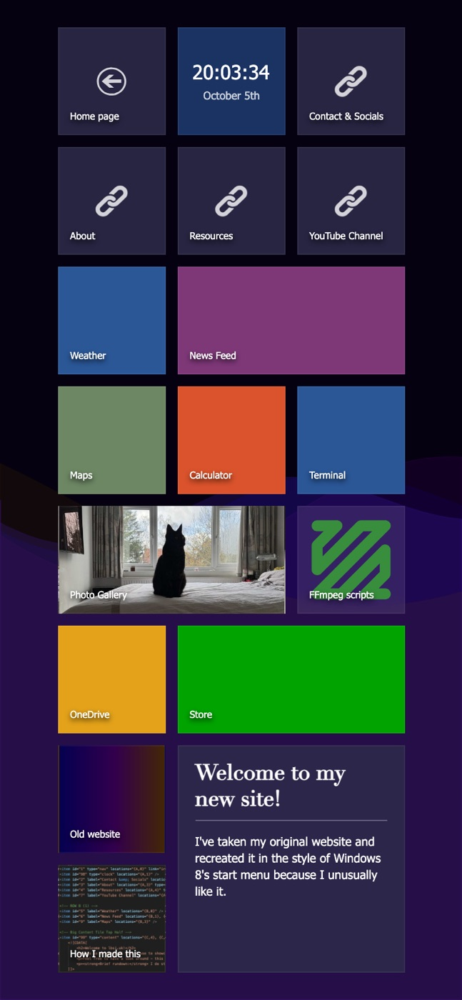
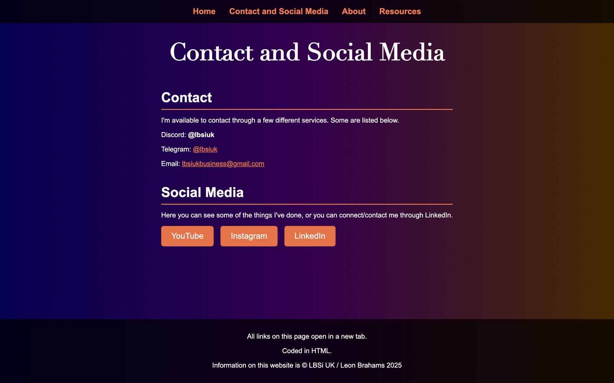
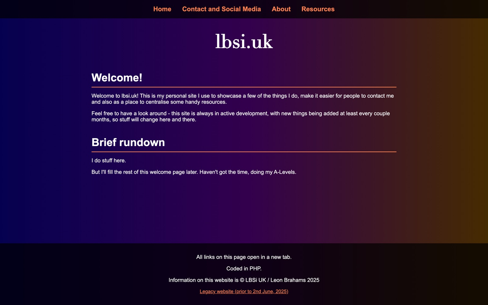
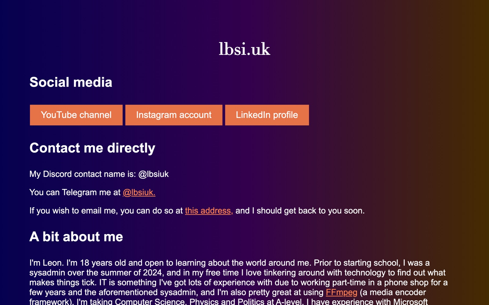
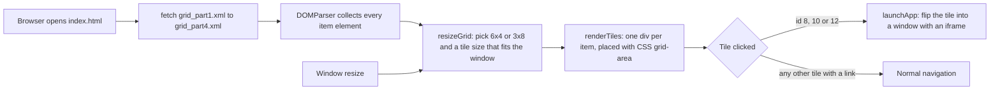

# lbsi.uk

The source of [lbsi.uk](https://lbsi.uk), Leon Brahams's personal website. It is where people can find his contact details and social links, read a short about page and pick up a few resources (mostly FFmpeg notes).

The homepage is styled after the Windows 8 Start screen: a grid of tiles whose layout comes from small XML files rather than being written into the HTML. This repo also keeps the earlier versions of the site, so it doubles as an archive of how the site has changed. A new site is being built separately.

## Screenshots

All screenshots were taken from a local preview of this repo (there is no outside data to stub). The clock tile shows the time of capture, and the plain tiles get a random colour on every load, so yours will look slightly different.


*The current homepage (`index.html`) in a 1440 x 900 window.*


*Some tiles open their page in an in-page window with a flip animation instead of navigating away.*



*On a portrait screen the same tiles are rearranged into 3 columns by 8 rows.*


*`previous/`, the static HTML version of the site that came before the tile grid.*


*`theoldsite/`, the original PHP site.*


*`theoldsite/previous.html`, the single-page site that the PHP site replaced.*

## Versions in this repo

Oldest first. The dates are the ones the pages themselves give.

| Version | Where | Built with | Notes |
| --- | --- | --- | --- |
| Early single pages | `theoldsite/legacy.html`, `theoldsite/previous.html`, `theoldsite/indexold.html` | Plain HTML and inline CSS | `legacy.html` is the site from before 6 August 2024; `previous.html` is the one from then until 2 June 2025. |
| Original PHP site | `theoldsite/*.php` (drafts in `theoldsite/beta/`) | PHP includes | Replaced `previous.html` on 2 June 2025. Each page includes `pagesetup.php` (favicon and nav bar) and `footer.php`. |
| Previous site | `previous/` | Static HTML | The PHP site converted to plain HTML pages. The tile grid's Old website, Contact, About and Resources tiles open these pages. |
| Current site | `index.html`, `grid_part1-4.xml`, `styles.css`, `images/` | HTML, CSS and vanilla JavaScript, no build step | The Windows 8 style tile grid that is live at lbsi.uk. |
| Unused redesign | Branch [`redesign-wip`](https://github.com/LBSiUK/lbsiukwebsite/tree/redesign-wip), also published as [LBSiUK/lbsi.uk-unused-redesign](https://github.com/LBSiUK/lbsi.uk-unused-redesign) | Static HTML, CSS and JS | A replacement design that was started and not used. |

## Features of the tile grid

- Tile positions, labels, links and images come from four XML files, so the layout can be changed without touching the HTML or JavaScript.
- Tiles can span several cells (the welcome panel covers a 2 x 2 block).
- Tile types: a home tile, a live clock and date, link tiles with an icon, a content tile that renders HTML from the XML, and plain coloured tiles (random Windows 8 palette colour, or a background image).
- Selected tiles open their page in a window inside the homepage with a flip animation and a close button.
- The grid resizes to fit the window and switches between 6 x 4 (landscape) and 3 x 8 (portrait).
- An animated "silk" wave background drawn on a canvas.

## How to preview it locally

You need PHP 8 for the PHP site; the tile grid and `previous/` are static and work with any static web server. Tested with PHP 8.5 and Python 3.

```sh
git clone https://github.com/LBSiUK/lbsiukwebsite.git
cd lbsiukwebsite
php -S 127.0.0.1:8000 -t .
```

Then open:

- http://127.0.0.1:8000/ for the current tile grid
- http://127.0.0.1:8000/previous/ for the previous static site
- http://127.0.0.1:8000/theoldsite/ for the original PHP site
- http://127.0.0.1:8000/theoldsite/previous.html and `legacy.html` for the early single pages

Without PHP, `python3 -m http.server 8000` serves everything except the `.php` pages. Opening `index.html` straight from disk (`file://`) does not work, because the page fetches its XML files and browsers block that for local files.

Note that PHP's built-in server answers a request for a missing file with the nearest `index` page instead of a 404, so a link to a page that is not in the repo shows the homepage again rather than an error.

There is no build step and there are no tests.

## How the tile grid works



`index.html` holds everything apart from the shared `styles.css`: the tile styles, the canvas background script and the grid script. When the page loads it fetches the four XML files, collects every `<item>` and renders the grid. On every resize it works out the tile size again and redraws all tiles.

### The grid and the XML files

In landscape the grid has rows `A` to `D` and columns `0` to `5`. Each XML file holds one quarter of it:

| File | Rows | Columns |
| --- | --- | --- |
| `grid_part1.xml` | A to B | 0 to 2 |
| `grid_part2.xml` | A to B | 3 to 5 |
| `grid_part3.xml` | C to D | 0 to 2 |
| `grid_part4.xml` | C to D | 3 to 5 |

The split matters for portrait screens. There the grid becomes 3 columns by 8 rows: the top two rows are interleaved (left half of row A, right half of row A, left half of row B, right half of row B) and the bottom half is stacked (left half of rows C and D, then the right half). Keeping each tile inside one quarter keeps it in one piece after that rearrangement.

An item looks like this:

```xml
<item id="12" label="Photo Gallery" locations="{C,0}, {C,1}" link="gallery.html" image="images/pslide-roger.jpeg"/>
```

| Attribute | Meaning |
| --- | --- |
| `id` | Identifier. Items `8`, `10` and `12` open in the in-page window; this list is set in `renderTiles()` in `index.html`. |
| `label` | Text shown at the bottom of the tile. |
| `locations` | One or more cells as `{Row,Column}`. The tile covers the rectangle that contains all of them. |
| `type` | `nav` (home arrow), `clock` (live clock and date), `menu` (dark tile with a link icon), `content` (renders the HTML inside the item's `CDATA` block). Leave it out for a plain coloured tile. |
| `link` | Page or URL to open when the tile is clicked. |
| `image` | Background image for the tile. Tiles without one get a random colour. |

Every cell should be covered by exactly one item; the current four files fill all 24.

`gridlayout.xml` is an older single-file version of the same layout. `index.html` does not load it, and some of its links (such as `indexold.html`) are out of date.

### Project layout

```
.
├── index.html          current homepage: styles, canvas background and grid script
├── grid_part1-4.xml    tile layout, one file per quarter of the grid
├── gridlayout.xml      older single-file layout (not loaded)
├── styles.css          shared styles and the Roman heading font
├── Roman.otf           heading font
├── back.svg, fav.ico   home tile arrow and favicon
├── images/             tile images and the link icon
├── about.php           stray copy of the PHP about page (see below)
├── previous/           previous site as static HTML pages
├── theoldsite/         original PHP site, early single pages and beta/ drafts
└── docs/screenshots/   images used in this README
```

## Status and known gaps

- Weather, News Feed, Maps, Calculator, Terminal, OneDrive and Store are placeholder tiles with no link.
- The Photo Gallery, FFmpeg scripts and How I made this tiles link to `gallery.html`, `ffmpegscripts.html` and `howitsmade.html`, which are not in this repo.
- `about.php` in the root includes `header.php` and `footer.php`, which are not in the repo, so it prints PHP warnings. Nothing links to it.
- The about pages load the photo from `https://lbsi.uk/images/leon.jpeg`, so it only appears with an internet connection.
- The PHP pages print the nav bar before `<!DOCTYPE html>`, so browsers render them in quirks mode.
- Tiles are `div`s with click handlers, so they cannot be reached with the keyboard.

## Copyright

No licence file is included. The site footer reads: "Information on this website is © LBSi UK / Leon Brahams 2025".
